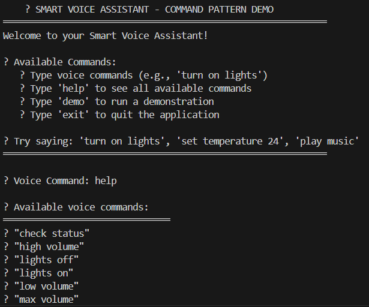
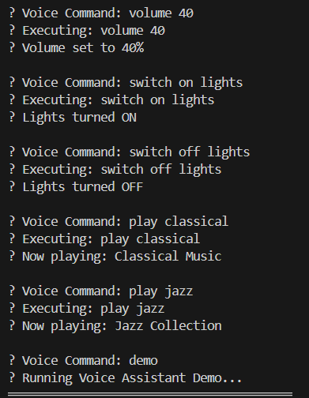
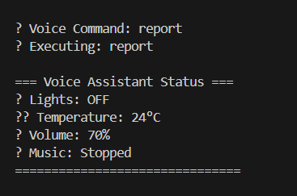
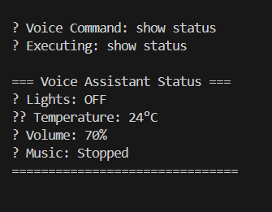

# Exercise 1 - Behavioral - Command Pattern

Here's a simple README file for your Command Pattern Voice Assistant project:

# Voice Assistant - Command Pattern

A Java implementation of the Command Pattern using a smart home voice assistant.

## Description

This project demonstrates the **Command Pattern** (Behavioral Design Pattern) through an interactive voice assistant that controls smart home devices. Users can control lights, temperature, music, and volume using natural voice commands.

## Features

- **Voice Commands**: Control devices with natural language
- **Smart Lighting**: Turn lights on/off
- **Temperature Control**: Set thermostat (16-30°C)
- **Music Control**: Play/stop music with different genres
- **Volume Control**: Adjust volume (0-100%)
- **Status Display**: View current device status
- **Demo Mode**: Automated demonstration

## Quick Start

### Requirements
- Java 8 or higher

### Run the Application

1. **Compile the code:**
   ```bash
   cd src
   javac behavioral/command/*.java
   ```

2. **Run the application:**
   ```bash
   java behavioral.command.VoiceAssistantApp
   ```

## Usage

Type voice commands like:
- `"turn on lights"`
- `"set temperature 24"`
- `"play jazz"`
- `"volume 70"`
- `"show status"`

Special commands:
- `help` - Show all available commands
- `demo` - Run demonstration
- `exit` - Quit application

## Project Structure

```
behavioral/command/
├── Command.java              # Command interface
├── VoiceReceiver.java        # Device operations
├── LightOnCommand.java       # Light commands
├── LightOffCommand.java      
├── SetTemperatureCommand.java # Temperature control
├── PlayMusicCommand.java     # Music commands
├── StopMusicCommand.java     
├── SetVolumeCommand.java     # Volume control
├── ShowStatusCommand.java    # Status display
├── VoiceAssistantInvoker.java # Command manager
└── VoiceAssistantApp.java    # Main application
```

## Design Pattern

This project implements the **Command Pattern** with:
- **Command Interface**: Defines command contract
- **Concrete Commands**: 7 specific command implementations
- **Receiver**: Performs actual device operations
- **Invoker**: Manages and executes commands
- **Client**: Sets up the entire system


**Total Files**: 11 Java files  
**Pattern**: Command Pattern (Behavioral)  
**Lines of Code**: ~500 lines

**Example Outputs**





