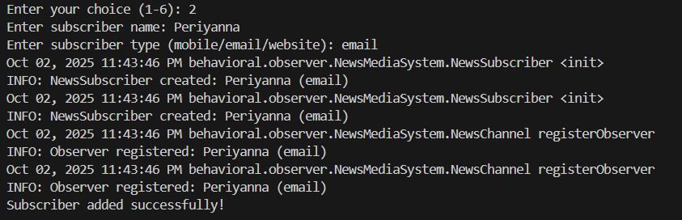

# News Media Observer Pattern

## Overview
Java implementation of the Observer design pattern using a news media system. Demonstrates real-time notification distribution to multiple subscriber types.

## Structure
```
src/behavioral/observer/NewsMediaSystem/
├── NewsMediaApplication.java    # Main application
├── NewsChannel.java            # Subject (news publisher)
├── NewsSubscriber.java         # Observer (subscriber)
├── Observer.java              # Observer interface
└── Subject.java               # Subject interface
```

## Pattern Implementation
- **Subject**: NewsChannel manages observers and broadcasts news updates
- **Observer**: NewsSubscriber receives and processes notifications
- **Client**: NewsMediaApplication provides interactive console interface

## Features
- Interactive menu system for news publishing
- Dynamic subscriber management (add/remove)
- Multi-platform notifications (mobile, email, website)
- Real-time broadcast to all registered observers
- Input validation and error handling

## Compilation
```bash
cd src
javac behavioral/observer/NewsMediaSystem/*.java
```

## Execution
```bash
java behavioral.observer.NewsMediaSystem.NewsMediaApplication
```

## Use Cases
- News broadcasting systems
- Alert notification platforms
- Social media update distribution
- Stock market data feeds
- Event-driven architectures

## Benefits
- **Loose Coupling**: Independent subject and observer components
- **Dynamic Relationships**: Runtime subscription management
- **Scalable Architecture**: Easy addition of new observer types
- **Event-Driven Design**: Reactive notification system

## Technical Notes
- Implements standard Observer pattern structure
- Uses Java logging framework
- Thread-safe observer collection handling
- Comprehensive input validation

## Example Outputs





