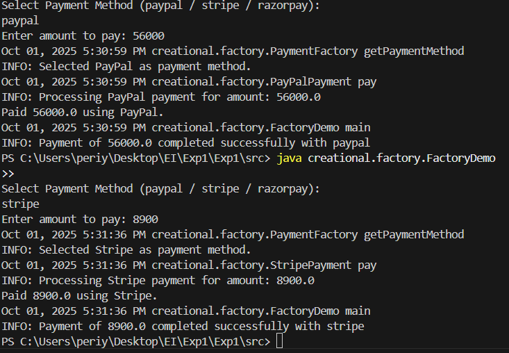

Here’s a clean, **formal short README** content you can use for the **Factory Payment Integration** project:

---

# Factory Pattern – Payment Integration System

##  Overview

This project demonstrates the **Factory Design Pattern** in Java using a real-world use case of a **Payment Integration System**.
The factory dynamically creates payment method objects (PayPal, Stripe, RazorPay) at runtime based on user input.

---

## 📂 Folder Structure

```
src/
 └── creational/
      └── factory/
           ├── Payment.java
           ├── PayPalPayment.java
           ├── StripePayment.java
           ├── RazorPayPayment.java
           ├── PaymentFactory.java
           └── FactoryDemo.java
```

---

## How to Compile & Run

1. Navigate to the `src` directory:

   ```sh
   cd src
   ```

2. Compile all Java files:

   ```sh
   javac creational/factory/*.java
   ```

3. Run the demo:

   ```sh
   java creational.factory.FactoryDemo
   ```

---

## Features

* Implements **Factory Pattern** for payment selection.
* Runtime input for payment method and amount.
* **Logging mechanism** (console + file `payment.log`).
* Validations & exception handling for invalid inputs.
* Extensible for adding more payment gateways.

---

##  Example Run


