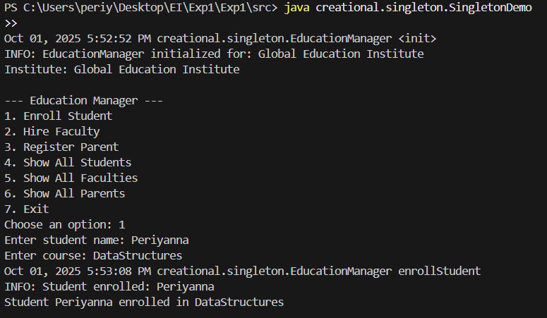
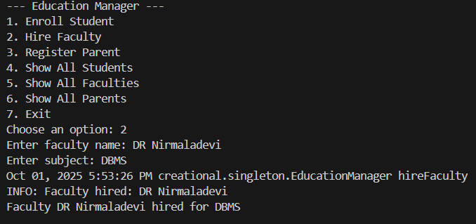
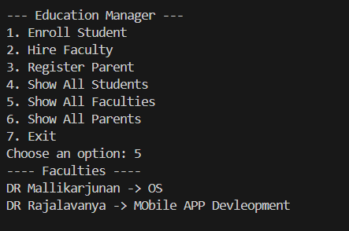

**Singleton Pattern – Education Central Manager**

This project demonstrates the Singleton Design Pattern in Java using a central education management system.
The EducationManager acts as a single point of control for managing Students, Faculty, and Parents within an educational institute.

📂 **Folder Structure **
src/
 └── creational/
      └── singleton/
           ├── EducationManager.java
           ├── SingletonDemo.java
           ├── Faculty.java
           ├── Student.java
           └── Parent.java

How to Compile & Run

Open terminal/command prompt and navigate to the src folder:

cd project/src

Compile all Java files:

javac creational/singleton/*.java

Run the demo:

java creational.singleton.SingletonDemo

**Features**

1.Implements Singleton Pattern for centralized management.

2.Menu-driven runtime inputs for:

3.Enrolling Students

4.Hiring Faculty

5.Registering Parents

6.Displaying all entities

7.Logging mechanism to console + file (education.log).

8.Defensive programming and input validation.

9.Extensible and modular with separate classes for each entity.

Example Run
--- Education Manager ---
1. Enroll Student
2. Hire Faculty
3. Register Parent
4. Show All Students
5. Show All Faculties
6. Show All Parents
7. Exit
Choose an option: 1
Sample Outputs : 

Logs of all operations are saved to education.log in the same folder.
