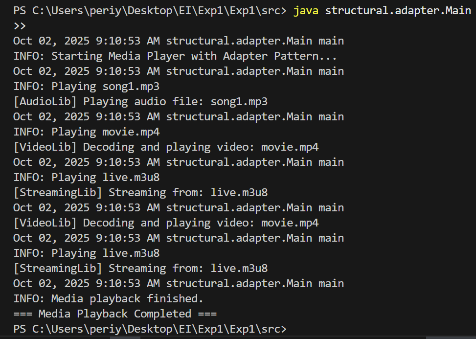

# Media Player with Adapter Pattern

## Overview

This project demonstrates the **Adapter Design Pattern** in Java through a **media player system**. The system supports multiple media types (`mp3`, `mp4`, `m3u8`) by using adapters that **bridge incompatible interfaces** and allow seamless playback.

* **AudioAdapter**: Handles audio files (`mp3`).
* **VideoAdapter**: Handles video files (`mp4`).
* **StreamingAdapter**: Handles streaming content (`m3u8`).

The Adapter Pattern allows adding new media types without modifying existing code, following the **Open/Closed Principle**.


## Features

* Play multiple media formats using a unified interface.
* Dynamically register adapters for each media type.
* Logging of all playback events in `logs/adapter-media.log`.
* Handles unsupported media types gracefully with warnings.

---

## Project Structure

```
structural/
 └── adapter/
      ├── Main.java           # Entry point
      ├── MediaPlayer.java    # Adapter interface
      ├── AudioAdapter.java
      ├── VideoAdapter.java
      ├── StreamingAdapter.java
      ├── MediaContent.java   # Media metadata
      └── LoggerUtil.java     # Logger utility
```

---

## Compilation & Execution

1. Navigate to the `src` folder:

```bash
cd src
```

2. Compile all Java files:

```bash
javac structural/adapter/*.java
```

3. Run the main class:

```bash
java structural.adapter.Main
```

---

## Usage

* The application automatically iterates through a playlist of different media types.
* Playback events are logged and printed to the console.
* Unsupported media types are reported via logger warnings.

---

## Design Pattern

**Adapter Pattern**: Allows incompatible media interfaces to be used with a common `MediaPlayer` interface, enabling seamless integration of different media types without altering the existing codebase.

---

## Logging

* All events are logged in `logs/adapter-media.log`.
* Sample logs:

```
2025-10-02T23:45:12 - Playing song1.mp3
2025-10-02T23:45:15 - Playing movie.mp4
2025-10-02T23:45:20 - Playing live.m3u8
```

---

## Output



---

## Requirements

* Java JDK 11 or higher.
* Console/terminal for execution.


