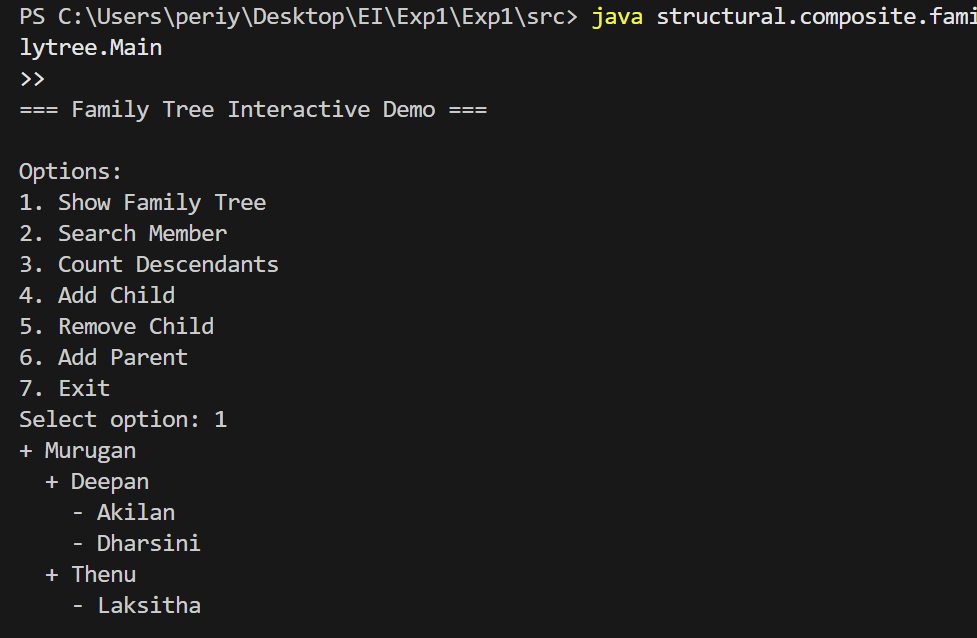
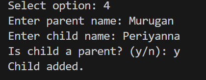
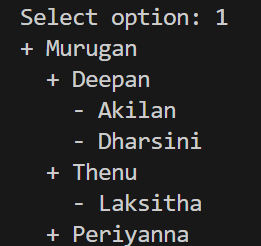
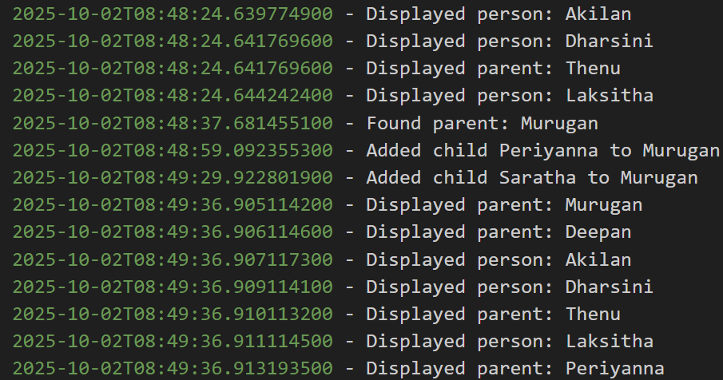

# Family Tree Interactive System

## Overview

This project demonstrates the **Composite Design Pattern** using a **family tree management system** in Java. The system allows dynamic creation, manipulation, and exploration of family members, where each member can either be a **leaf node (`Person`)** or a **composite node (`Parent`)** with children.

The Composite Pattern allows treating **individual objects and groups of objects uniformly**, enabling operations like displaying the family tree, searching for members, counting descendants, and adding/removing members recursively.

---

## Features

* Interactive console-based application with a menu-driven interface.
* Support for:

  * Displaying the full family tree.
  * Searching for a member by name.
  * Counting descendants of any member.
  * Adding a child to any parent.
  * Removing a child from any parent.
  * Adding a new parent dynamically at runtime.
* Logging mechanism: all significant operations are logged into `familytree.log`.
* Recursive implementation ensures consistent operations across all levels of the family tree.

---

## Project Structure

```
structural/
 └── composite/
      └── familytree/
           ├── FamilyMember.java       # Interface representing any family member
           ├── Person.java             # Leaf node (no children)
           ├── Parent.java             # Composite node (can have children)
           ├── FamilyTreeLogger.java   # Logging utility
           └── Main.java               # Interactive console application
```

---

## Classes

### `FamilyMember` (Interface)

* Methods:

  * `display(String indent)`: Recursively display member and children.
  * `search(String name)`: Search for a member by name.
  * `countDescendants()`: Count all descendants recursively.

### `Person` (Leaf)

* Represents a family member with no children.
* Implements `FamilyMember` interface.

### `Parent` (Composite)

* Represents a family member that can have children (`Person` or `Parent`).
* Implements `FamilyMember` interface.
* Provides methods:

  * `addChild(FamilyMember child)`
  * `removeChild(FamilyMember child)`

### `FamilyTreeLogger`

* Utility class for logging all operations to `familytree.log`.
* Ensures traceability and debugging support.

### `Main`

* Interactive console application.
* Provides menu options for displaying tree, adding/removing children, adding parents, counting descendants, and searching members.
* Demonstrates the **Composite Pattern** in a practical use case.

---

## Compilation & Execution

1. Open a terminal in the `src/` folder.

2. Compile the project:

```bash
javac structural/composite/familytree/*.java
```

3. Run the application:

```bash
java structural.composite.familytree.Main
```

---

## Usage

Upon running, the console displays an interactive menu:

```
Options:
1. Show Family Tree
2. Search Member
3. Count Descendants
4. Add Child
5. Remove Child
6. Add Parent
7. Exit
```

* **Show Family Tree:** Prints all members recursively.
* **Search Member:** Finds a member by name.
* **Count Descendants:** Shows number of descendants of a member.
* **Add Child:** Adds a `Person` or `Parent` under an existing parent.
* **Remove Child:** Removes a child from a parent.
* **Add Parent:** Adds a new `Parent` dynamically and optionally attaches it under an existing parent.

All actions are logged in `familytree.log`.

**Example Outputs**







---

## Design Pattern

**Composite Pattern** is used to:

* Treat individual family members (`Person`) and groups of members (`Parent`) uniformly.
* Allow recursive operations without knowing whether a node is a leaf or composite.
* Simplify client code for tree traversal and management.

---

## Logging

* The system writes all key actions (e.g., adding/removing members, displaying nodes) to `familytree.log`.
* Example log entries:



 ---

## Benefits

* Demonstrates **Composite Pattern** in a practical real-world scenario.
* Interactive runtime features allow flexible family tree manipulation.
* Supports **dynamic addition of parents and children**, showing extensibility.
* Logging ensures **traceability and debugging** for long-running sessions.

---


