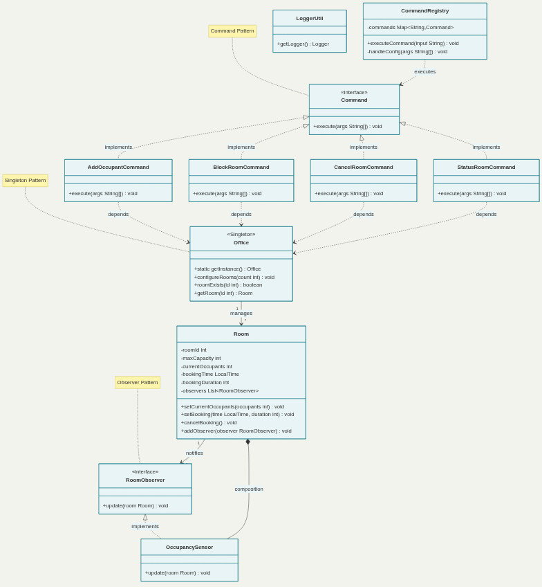
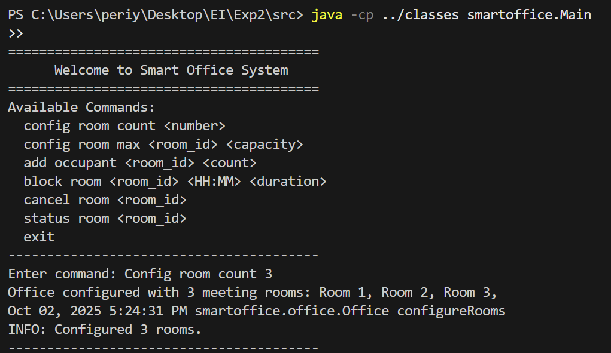
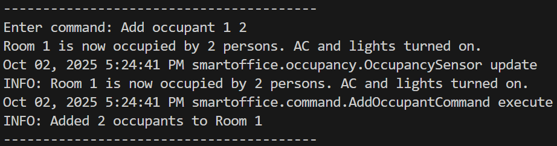
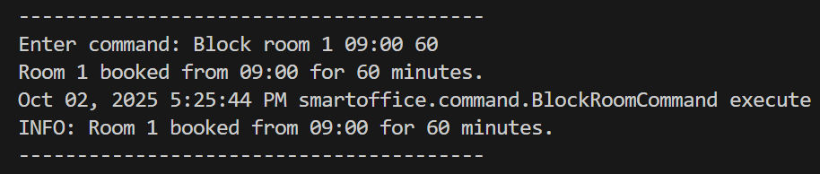
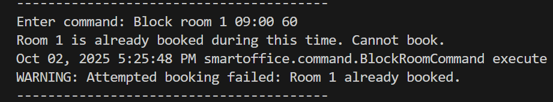
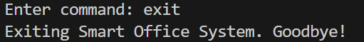
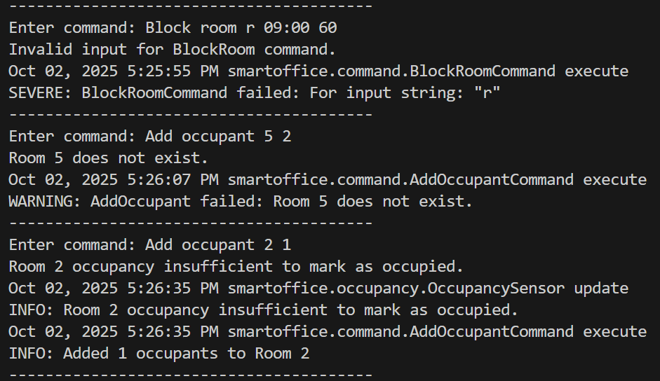
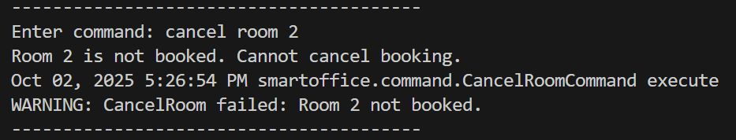

## Excercise 2

# Title : Smart Office Facility 

## Project Overview

The **Smart Office Facility** is a **console-based application** designed to manage office conference rooms efficiently. It handles **room bookings, occupancy detection, and automation of air conditioning and lighting** based on real-time occupancy. The project demonstrates **best coding practices, design patterns, and scalable, maintainable software design**.

---

## Problem Statement

* Users can configure office facilities specifying the number of meeting rooms.
* Rooms can be booked, canceled, and monitored for occupancy.
* Occupancy detection triggers automation such as turning **AC and lights on/off**.
* Unoccupied rooms automatically release bookings if not used within **5 minutes**.

---

## Functional Requirements

### Mandatory

1. Configure office rooms and their capacities.
2. Book and cancel conference rooms.
3. Detect occupancy with sensors (minimum 2 people).
4. Auto-release unoccupied bookings after 5 minutes.
5. Turn off AC and lights for unoccupied room


1. Provide room usage statistics.
2. Implement user authentication for restricted actions.
3. Notify users when a booked room is released automatically.

---

##  Design Patterns Included

 **Singleton**  `Office` class ensures a single global instance managing all rooms.                                                                         
 **Observer**  `Room` notifies `OccupancySensor` whenever occupancy changes, controlling AC/lights automatically.                                        
 **Command**   `Command` interface and concrete commands (`AddOccupantCommand`, `BlockRoomCommand`, etc.) handle operations flexibly via `CommandRegistry`. 

---

## Project Architecture

src/
├─ Main.java                  # Application entry point
├─ smartoffice/
│   ├─ office/
│   │   ├─ Office.java        # Singleton: manages rooms & bookings
│   │   └─ Room.java          # Represents a room; Observer implemented
│   ├─ command/
│   │   ├─ Command.java       # Interface for commands
│   │   ├─ AddOccupantCommand.java
│   │   ├─ BlockRoomCommand.java
│   │   ├─ CancelRoomCommand.java
│   │   ├─ StatusRoomCommand.java
│   │   └─ CommandRegistry.java
│   ├─ occupancy/
│   │   ├─ RoomObserver.java  # Observer interface
│   │   └─ OccupancySensor.java
│   ├─ util/
│   │   └─ LoggerUtil.java    # Centralized logging
│   └─ test/
│       └─ TestSmartOffice.java # Tests positive & negative scenarios
 

### Class Organization

* **smartoffice.office**

  * `Office.java` (Singleton)
  * `Room.java` (Observer subject)
* **smartoffice.occupancy**

  * `RoomObserver.java` (interface)
  * `OccupancySensor.java` (Observer)
* **smartoffice.command**

  * `Command.java` (interface)
  * `AddOccupantCommand.java`
  * `BlockRoomCommand.java`
  * `CancelRoomCommand.java`
  * `StatusRoomCommand.java`
  * `CommandRegistry.java`
* **smartoffice.util**

  * `LoggerUtil.java` (centralized logging)
* **smartoffice.test**

  * `TestSmartOffice.java` (test cases for positive and negative scenarios)

---

### UML Diagram



---

## Key Features Implemented

* Configurable room count and capacities.
* Command-driven interface (`config`, `add`, `block`, `cancel`, `status`).
* Occupancy detection with automatic AC/light control.
* Automatic booking release for idle rooms.
* Robust error handling for invalid inputs.
* Logging implemented for all operations.
* Designed with SOLID principles, defensive programming, and high performance in mind.

---
## Output Samples
## Positive Test Cases












## Negative Test Cases





---

## Instructions to Run

1. Compile Java classes:

```bash
cd src
javac -d ../classes smartoffice\Main.java smartoffice\office\*.java smartoffice\occupancy\*.java smartoffice\command\*.java smartoffice\util\*.java smartoffice\test\*.java
```

2. Run the main application:

```bash
java -cp ../classes smartoffice.Main
```

3. Run test cases:

```bash
java -cp ../classes smartoffice.test.TestSmartOffice
```

---

## Coding Standards Followed

* Each class in a **separate file** with clear naming.
* **Logging mechanism** with `LoggerUtil`.
* **Exception handling** with graceful error messages.
* **No hard-coded loops**; uses flexible command-driven input.
* Defensive programming with input validation at every step.
* **Highly optimized** for performance with minimal memory footprint.

---

-